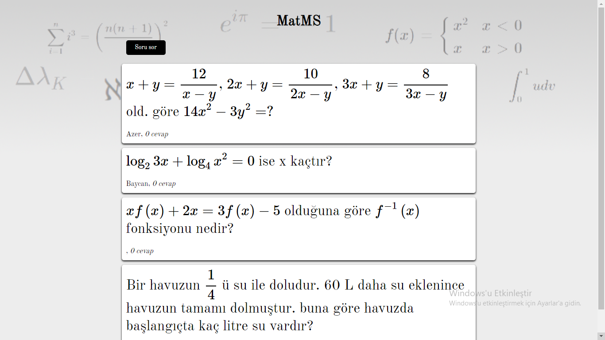
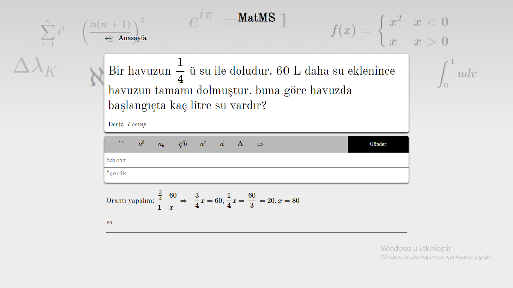

<style>
p, h1, h2, h3, h4, h5, h6, table, ul, ol, a {
  font-size: 12pt !important;
  font-family: 'Times New Roman', serif;
  text-align: justify;
  line-height: 1em;
  color: black !important;
}
p {
  text-indent: 1em;
}
table {
  page-break-inside: avoid;
}
th, td {
  border: 1px solid black !important;
}
ul {
  line-height: 1.5em;
}
pre[data-role="codeBlock"] {
  font-family: 'IBM Plex Mono', monospace;
}
pre[data-role="codeBlock"] > * {
  font-family: 'IBM Plex Mono', monospace;
}
.markdown-preview {
  padding: 0 2.5cm !important;
}

.sources > * {
  text-indent: -1em !important;
  padding-left: 1em ;
}
</style>

<!-- i love myself -->

# PROJE PLANI

## 1. Amaç ve Kapsam

Öğrencilerin yardımlaşması için matematiksel notasyon desteği bulunduran bir uygulama yapılacaktır. Sıradan soru-cevap platformlarındaki iletişim zorluğu ve erişilebilir olmama sorunlarının önüne geçerek öğrencilere ve matematik öğretmenlerine yardımlaşma konusunda destek olmak amaçlanmıştır. 

## 2. Yöntem ve Gereçler

### 2.1. Kullanıcı arayüzü

Sitenin kullanıcı arayüzü tasarlanacak ve Pug kullanarak yazılacaktır. Yaygın kullanılan matematik sembollerinin kolayca girilmesini sağlayan düğmeler oluşturulacaktır.

### 2.2. Veri tabanı oluşturulması

Cloud Firestore veri tabanı yaratılacak, soru ve cevaplar burada depolanacaktır. 

### 2.3. Sunucu tarafı kod yazılması

Arayüzün kullanıcıya sunulması, verinin kullanıcı arayüzünde gösterilmesi için Node.js ve Express.js ile sunucu oluşturulacaktır. Benzer şekilde yeni soru ve yanıtların gönderilmesi için yol sunulacaktır. Sunucu veri tabanı ile iletişim kuracak ve yeni soru eklenmesi durumunda kendini güncelleyecektir. 

## 3. İş-Zaman Tablosu
|                                                | Eylül | Ekim | Kasım | Aralık |
| ---------------------------------------------- | ----- | ---- | ----- | ------ |
| Kullanılacak teknolojilerin belirlenmesi       | X     |      |       |        |
| Uygulama kullanıcı arayüzünün tasarlanması     | X     |      |       |        |
| Uygulama arayüzünün kodlanması                 | X     | X    |       |        |
| Uygulamanın sunucu tarafı kodlarının yazılması |       | X    | X     | X      |

## Kaynaklar:

Çalışkan, T., & Çınar, S. (2010). Akran Desteği: Öğrencilerin Sınıf Ortamı Ve Uygulama Alanlarında Birbirleriyle Yardımlaşma 
Durumlarının Değerlendirilmesi. _Maltepe Üniversitesi Hemşirelik Bilim ve Sanatı Dergisi, Sempozyum Özel Sayısı_, 226-233.

Senkpiel, J., (2016). Node v7.2.0 (Current). 16 Aralık 2018 tarihinde erişildi. https://nodejs.org/en/blog/release/v7.2.0/

_About npm_. NPM. 16 Aralık 2018 tarihinde erişildi. https://www.npmjs.com/about.

Vorbach,P., npm-stat: download statistics for NPM packages. npm-stat. 16 Aralık 2018 tarihinde erişildi. https://npm-stat.com/charts.html?package=express&from=1970-01-31&to=2018-12-03

Gross, C., intercooler.js. 30 Aralık 2018 tarihinde erişildi. https://intercoolerjs.org

<div style="page-break-after: always;"></div>

# PROJE ÖZETİ

Öğrenciler için ders konusunda çevrimiçi bilgi alışverişi ve yardımlaşma platformları matematik konusunda yetersiz kalmaktadır. Öğrenciler matematik sembollerini kullanamadığından iletişim zorluğu çekebilir. Öğrenciler bu sorun karşısında elle yazdıkları matematik notasyonunun fotoğrafını çekip gönderme yoluna başvurabilse de bu ideal bir çözüm değildir ve görme engeli olan öğrencilerin erişimine kapalıdır. Bu sebeplerden dolayı projede matematiksel ifadeleri destekleyen bir yardımlaşma ortamı geliştirerek öğrencilerin matematik dersinde başarısına katkıda bulunmak amaçlanmıştır. 

Kullanıcı arayüzü Pug şablon motoru, CSS ve Intercooler.js ile yapılan uygulama PWA standardına uygundur. Bu sebeple mobil kullanıma elverişlidir ve tarayıcı üzerinden veya cihaza kurularak kullanılabilir. Uygulamada kullanıcılar AsciiMath dili ile matematik sembollerini ifade edebilmektedir. Matematik sembollerinin çizimi için MathJax kullanılmıştır. Kullanıcılar soru sorabilmekte ve sorulmuş sorulara cevap verebilmektedir.

Uygulamanın kaynak kodu Node.js ile yazılmış ve Express.js web altyapısı kullanılmıştır. Veri tabanı olarak Cloud Firestore tercih edilmiştir. Matematik ifadelerinin çizimi sunucuda yapılarak kullanıcının MathJax kütüphanesini indirmek zorunda kalmasının önüne geçilmiş ve uygulama daha hızlı kılınmıştır. 

Kullanıcıların soru sorması ve sorulmuş soruları cevaplandırması için bir uygulama yapılmıştır. Matematiksel notasyon desteği deneyen öğrenciler tarafından yeterli bulunmuştur. Öğrenciler dışında öğretmenler için de öğrencilerinin eğitimini destekleyerek fayda sağlayabilecek bir uygulamadır.

**Anahtar Kelimeler:** Matematik, eğitim, öğrenci, yardımlaşma, soru-cevap, notasyon 

<div style="page-break-after: always;"></div>

## Proje Adı:

**MatMS: Matematik Dersinde Öğrenciler Arasında Yardımlaşma Aracı**

## İçindekiler

- [PROJE PLANI](#proje-plani)
  - [1. Amaç ve Kapsam](#1-amaç-ve-kapsam)
  - [2. Yöntem ve Gereçler](#2-yöntem-ve-gereçler)
    - [2.1. Kullanıcı arayüzü](#21-kullanıcı-arayüzü)
    - [2.2. Veri tabanı oluşturulması](#22-veri-tabanı-oluşturulması)
    - [2.3. Sunucu tarafı kod yazılması](#23-sunucu-tarafı-kod-yazılması)
  - [3. İş-Zaman Tablosu](#3-İş-zaman-tablosu)
  - [Kaynaklar:](#kaynaklar)
- [PROJE ÖZETİ](#proje-Özetİ)
  - [Proje Adı:](#proje-adı)
  - [İçindekiler](#İçindekiler)
  - [1. Giriş](#1-giriş)
    - [1.1. Projenin Amacı](#11-projenin-amacı)
    - [1.2. Node.js](#12-nodejs)
    - [1.3. Express.js](#13-expressjs)
    - [1.5. MathJax](#15-mathjax)
    - [1.6. Pug](#16-pug)
  - [1.7. Intercooler.js](#17-intercoolerjs)
  - [2. Yöntem](#2-yöntem)
    - [2.1 Proje Yapım Basamakları](#21-proje-yapım-basamakları)
  - [3. Bulgular ve Gerçekleşme](#3-bulgular-ve-gerçekleşme)
    - [3.1 Veri tabanı oluşturulması](#31-veri-tabanı-oluşturulması)
      - [a.1. Firebase kurulumu](#a1-firebase-kurulumu)
      - [a.2. Admin SDK kurulumu](#a2-admin-sdk-kurulumu)
    - [3.2. Matematik yazımı](#32-matematik-yazımı)
      - [b.1. MathJax kütüphanesinin kurulumu](#b1-mathjax-kütüphanesinin-kurulumu)
      - [b.2. Matematik yazımı için arayüz kodlanması](#b2-matematik-yazımı-için-arayüz-kodlanması)
    - [3.3. Web sitesi](#33-web-sitesi)
      - [c.1. Anasayfa yapılması](#c1-anasayfa-yapılması)
      - [c.2. Soru görüntüleme sayfasının yapılması](#c2-soru-görüntüleme-sayfasının-yapılması)
      - [c.3. Dinamik içeriğin kullanıcıya sunumu](#c3-dinamik-içeriğin-kullanıcıya-sunumu)
      - [c.4. Soru sormak ve cevap vermek için yol oluşturulması](#c4-soru-sormak-ve-cevap-vermek-için-yol-oluşturulması)
    - [3.4. Proje Kodlarının Açıklanması](#34-proje-kodlarının-açıklanması)
      - [3.4.1 index.js](#341-indexjs)
      - [girdi.pug](#girdipug)
    - [3.5. Proje Ekran Görüntüleri](#35-proje-ekran-görüntüleri)
  - [4. Sonuçlar ve Tartışma](#4-sonuçlar-ve-tartışma)
  - [5. Öneriler](#5-Öneriler)
  - [Kaynakça](#kaynakça)

<div style="page-break-after: always;"></div>


## 1. Giriş

Öğrenciler akademik hedeflerine ulaşmak için sıkça sınıf arkadaşları yardımlaşır (Çalışkan ve Çınar, 2010). Birbiri ile bilgi paylaşan veya zorlandığı konularda birbirine danışan öğrenciler derslerinde daha hızlı ilerleme kaydedebilir. İnternet üzerindeki yardımlaşma platformlarının yetersizlikleri öğrencilere ders çalışırken zorluk oluşturabilir.

Bu platformlar matematik ve diğer sayısal derslerde vazgeçilmez olan notasyonu desteklememektedir. Çoğu matematiksel sembolü kullanmak mümkün değildir. Bu duruma karşılık öğrenciler elle yazdıkları ifadelerin çekmekte veya düz metin üzerinden okunaksız ve standarda bağlı olmayan bir biçem kullanmaktadır. İletişim zorluğu ve zaman kaybı görülmektedir. Görme engelli öğrenciler için erişilebilir değildir.

Proje kapsamında mevcut öğrenci yardımlaşma platformlarının belirli kusurlarına çözüm sunulmuştur. Bu kusurlar yetersiz notasyon desteği, dikkat dağıtıcı veya kullanışsız arayüz olarak saptanmıştır.

Proje mobil cihazlarda kullanıma uygundur. Kurulum gerektirmeden internet üzerinden kullanılabilir. İsteyen kullanıcılar uygulamayı cihazlarının ana ekranına ekleyebilir. 

### 1.1. Projenin Amacı

Projede öğrencilerin internet üzerinden yardımlaşırken ve bilgi alışverişi yaparken iletişim zorluğu yaşamasına ve zaman kaybı veya dikkat dağınıklığı sorunlarına çözüm bulmak amaçlanmıştır. 

### 1.2. Node.js

Node.js, JavaScript için bir çalıştırma ortamıdır. Durdurmayan G/Ç (İng. _non-blocking I/O_) desteğiyle asenkron programlamada kolaylık sağlar. Node.js, V8 JavaScript motorunu kullanır. Standart kütüphanesinde HTTP desteği bulundurduğundan ek bir sunucu yazılımına (Apache HTTP Sunucusu, Nginx, IIS vb.) gerektirmez (Senkpiel, 2016). Node.js paket yöneticisi npm, dünyanın en büyük yazılım kayıt defteridir (İng. _registry_) ("About npm", 2018).

### 1.3. Express.js

Express.js veya Express, Node.js için özgür açık kaynak kodlu web çatısıdır. 16 Kasım 2010 tarihinde 	TJ Holowaychuk tarafından yayınlanmıştır (Vorbach, 2018). Web uygulaması veya API geliştirmek için kullanılabilir. Diğer pek çok çatının altyapısını oluşturur. 

### 1.5. MathJax

MathJax, matematiksel ifadelerin çizimi için bir JavaScript kütüphanesidir. Girdi olarak TeX, MathML ve AsciiMath; çıktı olarak HTML-CSS, SVG ve MathML formatlarını destekler (Cuellar ve Topping, 2013).

### 1.6. Pug

Pug, HTML için bir önişlemcidir (İng. _preprocessor_). Sunucu veya istemci tarafından derlenebilir. Gömülü JavaScript ifadelerini değerlendirebilir. `for` ve `if` direktifleri ile dinamik içerikli sayfalar oluşturmayı kolaylaştırır. Gramer yapısı kısa ve okunaklı olması için tasarlanmıştır (Hiwarale, 2018).

## 1.7. Intercooler.js

Intercooler.js veya kısaca Intercooler, geliştiricilere kod yazmadan HTML öznitelikleri ile uygulamalara AJAX desteği ekleme olanağı sunan bir JavaScript kütüphanesidir. (Gross, 2018)
## 2. Yöntem

### 2.1 Proje Yapım Basamakları

__a. Veri tabanı oluşturulması__

- a.1. Firebase kurulumu
- a.2. Admin SDK kurulumu

__b. Matematik yazımı__

- b.1. MathJax kütüphanesinin kurulumu
- b.2. Matematik yazımı için arayüz kodlanması

__c. Web sitesi__

- c.1. Ana sayfa yapılması
- c.2. Soru görüntüleme sayfasının yapılması
- c.3. Dinamik içeriğin kullanıcıya sunumu
- c.4. Soru sormak ve cevap vermek için yol oluşturulması

## 3. Bulgular ve Gerçekleşme

### 3.1 Veri tabanı oluşturulması

#### a.1. Firebase kurulumu

Projede Firebase tarafından sunulan belge tabanlı Firestore veri tabanı kullanılmıştır. Firestore'un özellikleri belirli bir şemaya bağlı olmaması ve yalnızca hızlı biçimde yapılabilecek işlemlere izin vermesidir. 

Veri tabanındaki belgelerin yapısı aşağıdaki gibidir:

| Alan     | Tür        |
| -------- | ---------- |
| Yazan    | dize       |
| İçerik   | dize       |
| Zaman    | zaman      |
| Yanıtlar | koleksiyon |

<div class="noindent">
**Tablo 1.** _Veritabanında soru kayıtlarının yapısı_
</div>
Her sorunun Yanıtlar koleksiyonu aşağıdaki gibi belgeler içermektedir:

| Alan   | Tür   |
| ------ | ----- |
| Yazan  | dize  |
| İçerik | dize  |
| Zaman  | zaman |

<div class="noindent">
**Tablo 2.** _Veritabanında yanıt kayıtlarının yapısı_
</div>
#### a.2. Admin SDK kurulumu

Node.js sunucumuzdan veri tabanına erişim sağlayabilmek için Firebase Admin SDK kullanılmıştır. 

### 3.2. Matematik yazımı

#### b.1. MathJax kütüphanesinin kurulumu

Sayfalara MathJax eklenerek formüllerin gösterilmesi sağlanmıştır. Formüllerin yazımı için kolay olduğundan AsciiMath kullanılmıştır.

#### b.2. Matematik yazımı için arayüz kodlanması

Kullanıcılar AsciiMath kodlarını bilmeyebilir veya unutabilir. Bu sebeple soru sorma ve yanıtlama kısımlarına sıkça kullanılan sembolleri yazmak için düğmeler eklenmiştir.

### 3.3. Web sitesi

#### c.1. Anasayfa yapılması

Site Express.js ile yapılmıştır. Anasayfada sorulmuş sorulara bakmak ve yeni soru sormak mümkündür. 

#### c.2. Soru görüntüleme sayfasının yapılması

Her sorunun sayfasında sorunun içeriği, yazan kişi ve verilmiş yanıtlar gösterilir. Soruya bu sayfadan yanıt verilebilir.

#### c.3. Dinamik içeriğin kullanıcıya sunumu

Veri tabanından soru ve yanıtlar okunup Pug şablonları kullanılarak HTML sayfasına dökülür. Şablon kullanmak metin parçacıklarından sayfa oluşturma gereğini ortadan kaldırır ve kullanıcıların sorularında siteye HTML enjekte etmesine engel olur.

#### c.4. Soru sormak ve cevap vermek için yol oluşturulması

Sayfadan form/submit yoluyla soru sorulabilmektedir. Soruların sunucu tarafından doğrulanır ve gerekli veriyi bulunduruyorsa (yazan, içerik) veri tabanında kayıt oluşturulur.

### 3.4. Proje Kodlarının Açıklanması

#### 3.4.1 index.js

```javascript
const express = require("express"),
  cors = require("cors"),
  admin = require('firebase-admin'),
  bodyParser = require("body-parser"),
  mjpage = require("mathjax-node-page"),
  pug = require("pug")

let serviceAccount = JSON.parse(process.env.SERVICEACCOUNT) :
admin.initializeApp({
  credential: admin.credential.cert(serviceAccount),
  databaseURL: "https://mat-ms.firebaseio.com"
})

const db = admin.firestore()
```
İlk iş olarak kullanılacak kütüphaneler belirtilir.
Firebase admin sertifikası ortam değişkeninden okunur. Firebase ile bağlantı kurulur ve veri tabanına erişilir. 

```javascript
let yanitlarDepo = new Map()

async function belgeUyarla(belge: DocumentSnapshot) {
  return {
    ...belge.data(),
    id: belge.ref.id,
    yanitlar: await belge.ref.collection("Yanıtlar")
      .orderBy("Zaman", "desc")
      .get()
      .then(yanitlarOku)
  }

  function yanitlarOku(snapshot: QuerySnapshot): DocumentData[] {
    return snapshot.docs.map(doc => doc.data())
  }
}
```
`belgeUyarla` fonksiyonunun amacı veri tabanındaki belgelerden sayfada gösterilecek bilgileri çıkartmaktır. Bu fonksiyon ileride kullanılacaktır.

```javascript
let sorular
db.collection("Sorular").orderBy("Zaman", "desc").onSnapshot(
  async (snapshot) => {
    sorular = await Promise.all(snapshot.docs.map(belgeUyarla))
  })

```
Yeni soru eklendiğinde `sorular` değişkeninin güncellenmesi sağlanır.
```javascript
const app = express()
const sunucu = app.listen(3000)

app.use(express.static('wwwroot'))
app.use(bodyParser.urlencoded())
app.set('views', './views')
app.set('view engine', 'pug')

let indexTemplate = pug.compileFile(__dirname + "\\views\\index.pug", { cache: true })
let sorularTemplate = pug.compileFile(__dirname + "\\views\\sorular.pug")
let soruTemplate = pug.compileFile(__dirname + "\\views\\soru.pug")

mjpage.init()
```
Express ile sunucu oluşturulur. POST isteklerinden form verilerini okumak için `bodyParser.urlEncoded` kullanılır. Pug şablonları önceden derlenir.
```javascript
app.get("/", (req, res) => {
  res.send(indexTemplate({}))
})

app.get("/sorular", (req, res) => {
  let compiled = sorularTemplate({ sorular: sorular })
  mjpage.mjpage(compiled, { format: ["AsciiMath"], output: "html" }, {}, mjrendered => {
    res.send(mjrendered)
  })
})
```
Anasayfadan istek gönderildiğinde veri tabanından sorular alınır. Sorulardaki matematik ifadeleri çizilir. Son olarak sayfa oluşturulur ve kullanıcıya gönderilir.
```javascript
app.get("/soru", (req, res) => {
  db.collection("Sorular")
    .doc(req.query.id).get().then(async (snapshot) => {
      if (!snapshot.data) return res.status(404);
      let rendered = soruTemplate({ soru: await belgeUyarla(snapshot) })
      mjpage.mjpage(rendered,
        { format: ["AsciiMath"], output: "html" }, {}, sonuç => res.send(sonuç))
    })
})
```
Kullanıcı belirli bir soruya tıkladığında bu rotaya erişir. İstenen soru mevcut değilse 404 hatası verilir. Aksi takdirde soru verilerini içeren belge uyarlanır ve sayfa oluşturulur.
```javascript
app.post("/soru", (req, res) => {
  if (!req.body || 
    typeof req.body["Yazan"] !== "string" || 
    typeof req.body["İçerik"] !== "string"
  ) {
    return res.send(400/*Bad Request*/)
  }
  db.collection("Sorular").add({
    "Yazan": req.body["Yazan"],
    "İçerik": req.body["İçerik"],
    "Zaman": admin.firestore.Timestamp.now()
  })
  res.status(200)
  res.redirect("back")
})

app.post("/yanitla", (req, res) => {
  if (
    !req.query.id ||
    typeof req.body["Yazan"] !== "string" ||
    typeof req.body["İçerik"] !== "string"
  ) {
    return res.status(400)
  }
  db.collection("Sorular")
  .doc(req.query.id)
    .collection("Yanıtlar").add({
      "Yazan": req.body["Yazan"],
      "İçerik": req.body["İçerik"],
      "Zaman": admin.firestore.Timestamp.now()
    })
  res.status(200)
  res.redirect("back")
})
```
Kullanıcı soru veya cevap yazıp "Gönder" butonuna bastığı zaman POST isteği yapılır. Sunucu bunun üzerine öncelikle istekte doğru verinin bulunup bulunmadığını kontrol der. Yok ise 400 (Bad Request) hatası ile cevap verir. Aksi takdirde soru veri tabanına eklenir ve kullanıcı geri yönlendirilir.

#### girdi.pug
```pug
-
  let dugmeler = [
    {i: "\\`\\`", g: "``"},
    {i: "a^b", g: "^(b)"},
    {i: "a_b", g: "_(b)"},
    {i: "rootab", g: "root(a)(b)"},
    {i: "a^@", g: "^@"},
    {i: "veca", g: "veca"},
    {i: "Delta", g: "Delta"},
    {i: "=>", g: "=>"},
    {i: "{::}^({::}_int)", g: "int"}
  ]
form.girdi.card(action=postTo method="POST")
  #dugmeler
    ul(id="menu-closed")
      for dugme in dugmeler
        li.dugme
          a(href="#" 
            onclick!="sembolGir('"+dugme.g+"')").
            `#{dugme.i}`

  input(type="submit" value="Gönder")
  input.text#yazan(type="text" name="Yazan" placeholder="Adınız")
  textarea.text#icerik(name="İçerik" placeholder="İçerik" autocomplete="off")

  script.

    var icerik = document.querySelector("#icerik")
    function sembolGir(g) {
      icerik.setRangeText(
        g, icerik.selectionStart, icerik.selectionEnd)
      icerik.focus()
      return false
    }
    
```
Sunulacak düğmeler sunucu JavaScript kodunda tanımlanmıştır. `for` direktifi ile düğmelerin HTML kodu oluşturulmuştur. Her düğme tıklandığında belirli bir sembolün AsciiMath kodunu imlecin konumuna girer. Bu sayede kullanıcılar bu kodları ezberlemek zorunda kalmaz.

### 3.5. Proje Ekran Görüntüleri


<div class="noindent">

**Görsel 1.** _Mobil anasayfa_

</div>



<div class="noindent">

**Görsel 2.** _Anasayfa_

</div>



<div class="noindent">

**Görsel 3.** _Soru sayfası_

</div>

## 4. Sonuçlar ve Tartışma

Proje standart mobil uygulama olarak başlamıştır. Bu şekilde geliştirmenin yavaş ilerlediği görüldüğünde PWA yapılması kararlaştırılmıştır. Bu karar sonucunda çeşitli cihazlarda kullanılabilen bir uygulama geliştirmek mümkün olmuştur. Bununla birlikte cihazında az depolama alanı olan kullanıcılar uygulamayı yüklemeden kullanabilmiş, böylece kullanımın önündeki bir engel ortadan kaldırılmıştır. 

Proje ders çalışan öğrencilere kolaylık sağlamak için yapılmıştır. Yapılan uygulamayı kullanan öğrenciler kullanışlı ve kullanıcı dostu bulmuştur. Matematiksel notasyon desteğini yeterli bulmuşlardır. Matematik öğretmenleri öğrencilere yardım ederken bu uygulamanın işlerine yarayacağını söylemiştir. 

Bazı öğrencilerin uygulamayı ders dışı konuşma için kullandığı gözlemlenmiştir. Bu durumun test aşamasında uygulamayı öğretmenlerin kullanmamasından kaynaklandığı düşünülmektedir.

## 5. Öneriler

Kullanıcıları doğru cevap vermeye motive etmek için puan ve/veya rütbe sistemi eklenebilir. Doğru cevap veren öğrencilere ödül ve 
teşekkür amaçlı puan verilebilir.

Farklı sınıflar için ayrı odalar oluşturulabilir. Böylece kullanıcılar kendi seviyelerinde sorulara bakabilir. Benzer şekilde 
matematiğin farklı alt dalları ve konuları için de odalar yapılabilir.

Yapılan uygulama okullarda kullanılıp öğrencilerin kendi öğretmenleri ve sınıf arkadaşlarından yardım alması sağlanabilir.

Matematik dışında dersler için de özellikler eklenebilir. Örneğin kimya dersi için Lewis elektron nokta yapısı çizme özelliği 
eklenebilir. 

Yeni sorular soruldukça uygulamanın canlı olarak bu soruları göstermesi sağlanabilir.

## Kaynakça

<div class="sources">

Çalışkan, T., & Çınar, S. (2010). Akran Desteği: Öğrencilerin Sınıf Ortamı Ve Uygulama Alanlarında Birbirleriyle Yardımlaşma 
Durumlarının Değerlendirilmesi. _Maltepe Üniversitesi Hemşirelik Bilim ve Sanatı Dergisi, Sempozyum Özel Sayısı_, 226-233.

Senkpiel, J., (2016). Node v7.2.0 (Current). 16 Aralık 2018 tarihinde erişildi. https://nodejs.org/en/blog/release/v7.2.0/

_About npm_. NPM. 16 Aralık 2018 tarihinde erişildi. https://www.npmjs.com/about.

Vorbach,P., npm-stat: download statistics for NPM packages. npm-stat. 16 Aralık 2018 tarihinde erişildi. https://npm-stat.com/charts.html?package=express&from=1970-01-31&to=2018-12-03

Gross, C., intercooler.js. 30 Aralık 2018 tarihinde erişildi. https://intercoolerjs.org

Hiwarale, U., Pug.js to make your life easier with HTML templates, itnext. 30 Aralık 2018 tarihinde erişildi. https://itnext.io/pug-js-to-make-your-life-easier-with-html-templates-9c62273626e0

 Cuellar, A. ve Topping, P., (2013, Haziran). What you need to know about the Maths Stack. XML London'da sunulan bildiri. Erişim adresi: https://xmllondon.com/2013/xmllondon-2013-proceedings.pdf#page=63

</div>